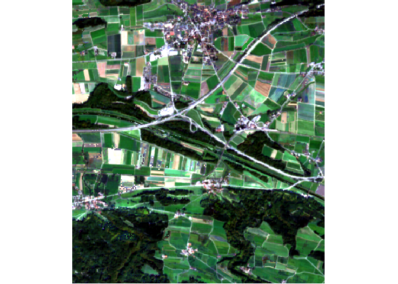
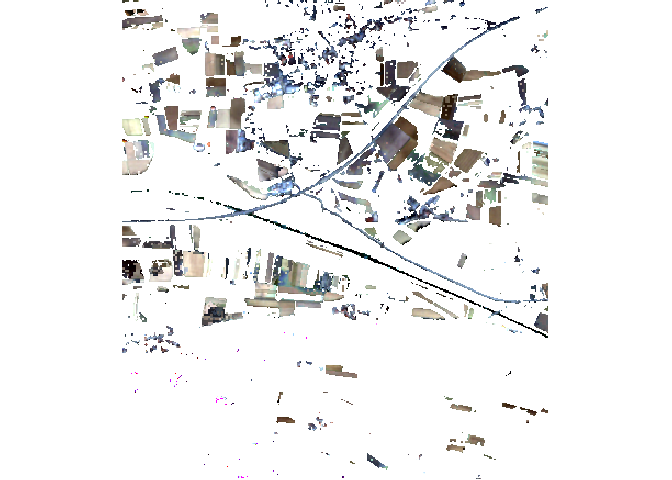
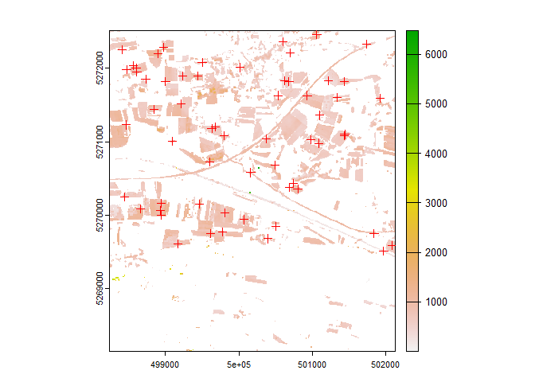
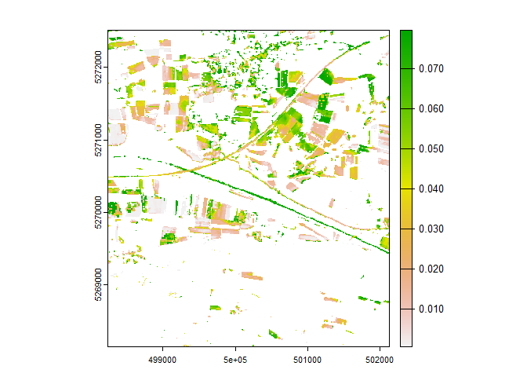
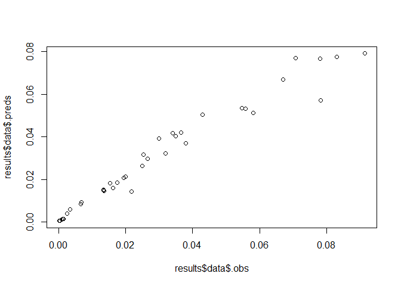

<!-- README.md is generated from README.Rmd. Please edit that file -->
<!-- badges: start -->
<!-- badges: end -->

# mscomposer - An R package for creating and analysing multi-spectral image composites

## Authors

Larissa Torney<sup>1</sup>, Michael Blaschek<sup>2</sup>, Darius
Görgen<sup>1</sup>

<sup>1</sup>Federal Institute for Geosciences and Natural Resources,
Stilleweg 2, 30655 Hannover, Germany

<sup>2</sup>State Authority for Geology, Resources and Mining,
Albertstraße 5, 79104 Freiburg, Germany

## About

The `{mscomposer}` package was created by BGR with the single use-case
of creating a composite image of multi-spectral satellite imagery over a
given area-of-interest in mind. This mutli-spectral composite serves
than as input to a machine learning model which is trained based on
reference points from the ground. It consists only of three functions,
which streamline this process. While the scope of the package is thus
rather limited, we have put substantial efforts to allow you to adapt
the function to your specific analysis. More specifically, this means
that you can use it with almost any satellite data set and supply custom
spectral indices and thresholds for composite creation. For the model
training process you can choose between several cross-validation
routines. However, it is advised to further analyse the model validity
for your study area, for instance via the
[CAST](https://hannameyer.github.io/CAST/) package.

This package was created at the BGR - Federal Institute for Geosciences
and Natural Resources - in the frame of the BopaBW project
([„Near-surface soil parameters
Baden-Wuerttemberg“](https://www.bgr.bund.de/EN/Themen/GG_Fernerkundung/Projekte/laufend/Multispektral/Boden-Stoffgehalte/BOPA_Baden_Wuerttemberg_en.html?nn=1551022)).

## How to cite

Please cite as follows:

Torney, L., Blaschek, M., & Görgen, D. (2023). mscomposer - An R package
for creating and analysing multi-spectral image composites (Version
0.0.1). <https://doi.org/10.25928/5yx7-x825>

## Installation

You can install `{mscomposer}` directly from GitHub with:

``` r
remotes::install_github("BGR-Geowissenschaften-Rohstoffe/mscomposer)
```

## Usage

We will showcase the general workflow of `{mscomposer}` based on a small
Sentinel-2 image collection and a simulated reference dataset. Note,
that the provided routines rely heavily on functionalities provided by
`{gdalcubes}`, `{sf}`, `{terra}`, and `{caret}` under the hood. For more
control over the processing, experienced users of these packages might
consider using them directly to create their own custom workflow.

## Big-Data processing

In the case your study area covers a large spatio-temporal extent you
might consider parallel processing in the composite creation. In this
case be advised to use `gdalcubes_options()` to enable parallel
processing before calling `compose()`. This way you can use the cores
available on your machine to speed up the composite generation process.
Also, in case the original image collection is quite large and you wish
to re-run your analysis with different settings, make sure to specify
the `col` argument in the `compose()` function so that you create the
image collection only once.

## Sentinel-2 Use Case

Within the `{mscomposer}` package we included a small subset of two
Sentinel-2 tiles for the year 2018 over an agricultural area in
Baden-Württemberg. In this use-case, we are interested to retrieve a
median composite of the visual channels containing only pixels when we
assume that the bare soil is visible. We are going to use a simple
heuristic to identify pixels with an NDVI pixel below a value of 0.3 to
represent bare soil pixels.

The data set was originally downloaded from the Copernicus Hub which
provides zip-files. In order for the data to fit into this package, we
included only a very small area between the overlapping tiles T32TNT and
T32TMT and flattened the directory structure so that we only keep those
band files we need in the scope of this tutorial. That also requires
that we write our own collection format. See this
[link](https://github.com/gdalcubes/collection_formats) for pre-defined
formats that come with `{gdalcubes}`

### True-Color Composite

In the first step, we will create a true-color-composite over the entire
year in order to get a first impression of the area of interest. For
that, we first have to define a cube view, i.e. a definition of the
spatio-temporal extent of our output data set. We provided a routine
called `view()` that allows you to specify an sf object to automatically
derive the bounding box of your study area. You can specify any valid
CRS, but we also allow you to derive a
[LAEA](https://proj.org/operations/projections/laea.html) or
[UTM](https://proj.org/operations/projections/utm.html) projection
automatically from your AOI.

First, we are going to load the libraries required for the processing.

``` r
library(sf)
#> Warning: Paket 'sf' wurde unter R Version 4.3.1 erstellt
#> Linking to GEOS 3.11.2, GDAL 3.6.2, PROJ 9.2.0; sf_use_s2() is TRUE
library(caret)
#> Lade nötiges Paket: ggplot2
#> Lade nötiges Paket: lattice
library(terra)
#> Warning: Paket 'terra' wurde unter R Version 4.3.1 erstellt
#> terra 1.7.39
library(gdalcubes)
#> 
#> Attache Paket: 'gdalcubes'
#> Die folgenden Objekte sind maskiert von 'package:terra':
#> 
#>     animate, crop, size
library(mscomposer)
```

In the present case, we set the temporal resolution of our cube view to
`"P3M"`, meaning that the intial calculation will be based on a temporal
resolution of three months. Since we also specify a final reducer, the
actual output raster will represent a single layer per band based on the
median of the three-month composites. The spatial resolution of the
visible Sentinel-2 channels is set to 10 meters. We also specify methods
understood by GDAL to aggregate pixels falling into the same time-step
as well a method to resample grid cells to the new output reference
grid.

We then provide the input files, format, and view to the `compose()`
function. We also specify an image mask which corresponds to bad quality
pixel in the Sentinel-2 [Scene Classification
Layer](https://sentinels.copernicus.eu/web/sentinel/technical-guides/sentinel-2-msi/level-2a/algorithm).
Since we are only interested in the color composite for now, we only
include the three visible channels in the composite generation. Finally,
we declare a method for the final reduction of the temporal dimension
and declare the output filename and directory.

``` r
outdir <- file.path(tempdir(), "mscomposer")
dir.create(outdir)
collection_path <- file.path(outdir, "s2_collection.sqlite")
s2_files <- list.files("inst/extdata/Sentinel2/", pattern = ".jp2$", full.names = TRUE, recursive = TRUE)
format <- system.file("Sentinel2_L2A_flat.json", package = "mscomposer")
head(basename(s2_files), 5)
#> [1] "T32TMT_20180422T102031_B02_10m.jp2" "T32TMT_20180422T102031_B03_10m.jp2"
#> [3] "T32TMT_20180422T102031_B04_10m.jp2" "T32TMT_20180422T102031_B08_10m.jp2"
#> [5] "T32TMT_20180422T102031_SCL_20m.jp2"
aoi <- st_read(system.file("aoi_S2.gpkg", package = "mscomposer"))
#> Reading layer `aoi2' from data source 
#>   `C:\Users\Wagener.N\AppData\Local\R\win-library\4.3\mscomposer\aoi_S2.gpkg' 
#>   using driver `GPKG'
#> Simple feature collection with 1 feature and 1 field
#> Geometry type: POLYGON
#> Dimension:     XY
#> Bounding box:  xmin: 8.97662 ymin: 47.56673 xmax: 9.02821 ymax: 47.60601
#> Geodetic CRS:  WGS 84

cv <- ms_view(
  aoi = aoi,
  srs = "utm",
  dt = "P3M",
  dx = 10,
  dy = 10,
  start = "2018-01-01",
  end = "2018-12-31",
  agg = "min",
  rsmp = "bilinear")

s2_rgb <- ms_compose(
  s2_files,
  format = format,
  view = cv,
  col = collection_path,
  mask = image_mask("SCL", values=c(1,3,6,8,9,10,11)),
  bands = c("B02", "B03", "B04"),
  reducers = "median",
  prefix = "rgb",
  outdir = outdir
)

(s2_rgb <- rast(s2_rgb[1]))
#> class       : SpatRaster 
#> dimensions  : 437, 389, 3  (nrow, ncol, nlyr)
#> resolution  : 10, 10  (x, y)
#> extent      : 498236.7, 502126.7, 5268143, 5272513  (xmin, xmax, ymin, ymax)
#> coord. ref. : +proj=utm +zone=32 +ellps=WGS84 +units=m +no_defs 
#> source      : rgb2018-01-01.tif 
#> names       : B02_median, B03_median, B04_median
plotRGB(s2_rgb, 3,2,1, stretch = "lin")
```



We can see that the dominant land use type in this area is agriculture.
We also observe some forest areas as well as a village with built-up
areas. In the next code example, we show how to calculate the NDVI and
filter valid pixels based on a NDVI threshold. This way, we wish to
include only those pixels in the composite calculation where we assume
that the satellite saw bare soil.

### Bare Soil Composite

We supply the formula of the NDVI and also make sure that we include all
bands necessary for its calculation in the processing. Additionally, we
supply a filtering statement. You can supply your own spectral indices
formula and filters. The only restriction is that the bands you are
using in your index calculation are also present in the data set.

For the NDVI calculation, we need the Near-Infrared channel, which
corresponds to band 8 in the case of Sentinel-2. We include this band in
the processing of the composite, thus we can refer to it in the
definition of our spectral index. We also include a filter based on our
index, meaning that only those pixel will be used for the computation
where the expression evaluates to `TRUE`.

``` r
s2_filt <- ms_compose(
  s2_files,
  format = format,
  view = cv,
  col = collection_path,
  mask = image_mask("SCL", values=c(1,3,6,8,9,10,11)),
  bands = c("B02", "B03", "B04", "B08"),
  indices = list(NDVI = "(B08-B04)/(B08+B04)"),
  filters = list(NDVI = "NDVI < 0.3"),
  reducers = "median",
  prefix = "soil",
  outdir = outdir
)

(s2_filt <- rast(s2_filt[1]))
#> class       : SpatRaster 
#> dimensions  : 437, 389, 5  (nrow, ncol, nlyr)
#> resolution  : 10, 10  (x, y)
#> extent      : 498236.7, 502126.7, 5268143, 5272513  (xmin, xmax, ymin, ymax)
#> coord. ref. : +proj=utm +zone=32 +ellps=WGS84 +units=m +no_defs 
#> source      : soil2018-01-01.tif 
#> names       : B02_median, B03_median, B04_median, B08_median, NDVI_median
plotRGB(s2_filt, 3,2,1, stretch = "lin")
```



In the result, we see that we mainly retained valid pixels for
agricultural fields. There are also pixels retained for a larger street,
which is characterized by low NDVI values during the entire year. We
also see some remaining artifacts. potentially originating from clouds
or snow cover which we should take care of in a real-world analysis.
While not being perfect, the above composite can well serve as the input
to further analysis, e.g. by supplying a vector data set of field
boundaries to only include pixels which actually lie on fields. Also,
several spectral indices and filters might be combined to suit the needs
of the analysis you are conducting.

### Model Training and Prediction

Continuing with our example, we now load a simulated reference data set
that we are using to train a Random Forest model.

``` r
(reference <- system.file("corg-simulated-sample.gpkg", 
                          package = "mscomposer") |>
   read_sf())
#> Simple feature collection with 60 features and 2 fields
#> Geometry type: POINT
#> Dimension:     XY
#> Bounding box:  xmin: 498411.7 ymin: 5269508 xmax: 502081.7 ymax: 5272458
#> Projected CRS: WGS 84 / UTM zone 32N
#> # A tibble: 60 × 3
#>       corg    ID               geom
#>      <dbl> <int>        <POINT [m]>
#>  1 0.0341      1 (502081.7 5269588)
#>  2 0.00342     2 (500801.7 5270358)
#>  3 0.0365      3 (500161.7 5270578)
#>  4 0.0134      4 (501431.7 5271818)
#>  5 0.0135      5 (498841.7 5271438)
#>  6 0.00249     6 (499611.7 5269748)
#>  7 0.0175      7 (500931.7 5271628)
#>  8 0.0253      8 (498611.7 5271948)
#>  9 0.00125     9 (501061.7 5272458)
#> 10 0.00873    10 (499001.7 5271818)
#> # ℹ 50 more rows

plot(s2_filt[[1]])
plot(reference, add = TRUE, pch = 3, col = "red")
#> Warning in plot.sf(reference, add = TRUE, pch = 3, col = "red"): ignoring all
#> but the first attribute
```

 To train
a model and use it for spatial prediction, we provide the
`raster_predict()` function. It expects an sf object containing only
POINT geometries as input as well as the specification of a column
containing numeric values as the target variable. Additionally, a
multi-layer SpatRaster object is required to extract the predictor
variables at the reference locations. Then a model is trained based on
the outcome variable and the extracted predictors. You can choose any
machine learning model supported by `{caret}` (see
[here](https://topepo.github.io/caret/available-models.html)), but note
that you might need to install additional dependencies to use them.
Also, you can chose between simple cross-validation patterns provided
via `trainControl()`’s `method` argument. Here we are going to train a
Random Forest model based on Leave-One-Observation-Out Cross-Validation.

``` r
results <- ms_predict(
  reference,
  colname = "corg",
  predictors = s2_filt,
  model_method = "rf",
  cv_method = "LOOCV"
)
#> Warning in ms_predict(reference, colname = "corg", predictors = s2_filt, : CRS of sf object and raster differ.
#> Trying to transform the sf object.
#> Warning in ms_predict(reference, colname = "corg", predictors = s2_filt, : Some predictors at sample locations are NA.
#> Excluding those locations from model training.
#> Warning in ms_predict(reference, colname = "corg", predictors = s2_filt, : A
#> total of 39 points remained for training.
```

As you can see from the above warnings and messages, the function takes
care of reprojecting the sf object in case its CRS differs from that of
the predictor raster. In the above example, there are also some
reference locations for which no valid pixels values are available.
Those locations are excluded before model training. The output of the
function is a list with several objects. We can look at the structure of
the list like this:

``` r
str(results, 1)
#> List of 4
#>  $ prediction:S4 class 'SpatRaster' [package "terra"]
#>  $ model     :List of 21
#>   ..- attr(*, "class")= chr "train"
#>  $ metrics   : Named num [1:3] 0.00538 0.96061 0.00341
#>   ..- attr(*, "names")= chr [1:3] "RMSE" "Rsquared" "MAE"
#>  $ data      :Classes 'sf' and 'data.frame': 39 obs. of  9 variables:
#>   ..- attr(*, "sf_column")= chr "geom"
#>   ..- attr(*, "agr")= Factor w/ 3 levels "constant","aggregate",..: NA NA NA NA NA NA NA NA
#>   .. ..- attr(*, "names")= chr [1:8] "ID" "B02_median" "B03_median" "B04_median" ...
```

The first object is the predicted raster dataset while the trained model
is the second object. We also find some accuracy metrics in the third
object while the last object contains those reference locations for
which valid pixels could be extracted.

Let’s have a look at the prediction raster. We see that we obtain
predicted values for all those raster cells that did not contain NA
values.

``` r
plot(results$prediction)
```



Next, we can inspect the model and the associated accuracies.

``` r
print(results$model)
#> Random Forest 
#> 
#> 39 samples
#>  5 predictor
#> 
#> No pre-processing
#> Resampling: Leave-One-Out Cross-Validation 
#> Summary of sample sizes: 38, 38, 38, 38, 38, 38, ... 
#> Resampling results across tuning parameters:
#> 
#>   mtry  RMSE        Rsquared   MAE        
#>   2     0.01120168  0.8186544  0.007278680
#>   3     0.01153438  0.8078481  0.007449167
#>   5     0.01199124  0.7937517  0.007796432
#> 
#> RMSE was used to select the optimal model using the smallest value.
#> The final value used for the model was mtry = 2.
print(results$metrics)
#>        RMSE    Rsquared         MAE 
#> 0.005376116 0.960608672 0.003413351
```

We see that the cross-validation results indicated an R-squared value of
about 0.41 while for the complete training data set we obtain an
R-squared value of about 0.90. Note, that the package currently does not
provide means to compare the model against a validation dataset,
however, since the model is an output you can validate against a
left-out dataset yourself.

The final output is an sf object with valid pixels in the predictor
raster. We include the extracted values per layer as well as the
reference variable and predictions (called `.preds` and `.obs`
respectively.)

``` r
results$data
#> Simple feature collection with 39 features and 8 fields
#> Geometry type: POINT
#> Dimension:     XY
#> Bounding box:  xmin: 498461.7 ymin: 5269508 xmax: 502081.7 ymax: 5272458
#> Projected CRS: WGS 84 / UTM zone 32N
#> First 10 features:
#>    ID B02_median B03_median B04_median B08_median NDVI_median      .preds
#> 1   1   688.5343   901.5608  1096.2508   1521.423   0.1705085 0.041666176
#> 2   2   932.9148  1344.3388  1555.1824   1998.333   0.1247077 0.005906884
#> 3   3   731.6961   892.4948   933.2104   1661.454   0.2805413 0.042059296
#> 4   4   733.3281  1069.5764  1394.8115   1936.749   0.1626677 0.015010429
#> 5   5   767.1676  1121.4152  1204.7492   2115.029   0.2741989 0.015112830
#> 6   6   901.3868  1367.9389  1673.1513   2140.540   0.1225554 0.004004245
#> 7   7   691.5490  1049.4650  1327.4365   1811.834   0.1550127 0.018437123
#> 8   8   770.7758   986.0261  1110.0377   1738.220   0.2205498 0.031756907
#> 9   9   956.2418  1376.7384  1652.1234   2808.753   0.2592831 0.001411906
#> 11 11   989.2407  1437.1266  1846.3208   2461.201   0.1443146 0.001152225
#>            .obs                     geom
#> 1  0.0341038048 POINT (502081.7 5269588)
#> 2  0.0034218308 POINT (500801.7 5270358)
#> 3  0.0365142519 POINT (500161.7 5270578)
#> 4  0.0134402760 POINT (501431.7 5271818)
#> 5  0.0135163756 POINT (498841.7 5271438)
#> 6  0.0024855349 POINT (499611.7 5269748)
#> 7  0.0174916751 POINT (500931.7 5271628)
#> 8  0.0253227711 POINT (498611.7 5271948)
#> 9  0.0012452079 POINT (501061.7 5272458)
#> 11 0.0009172905 POINT (498941.7 5270158)
plot(results$data$.obs, results$data$.preds)
```


