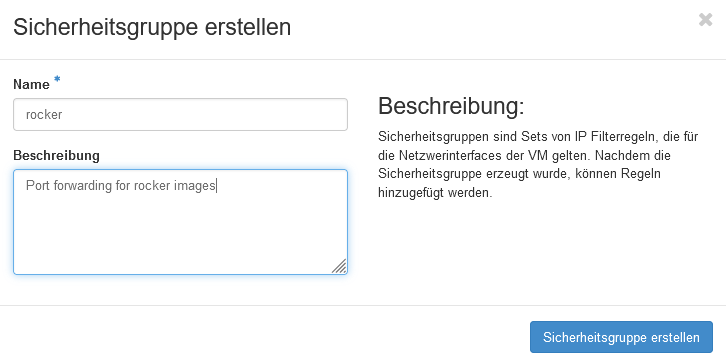
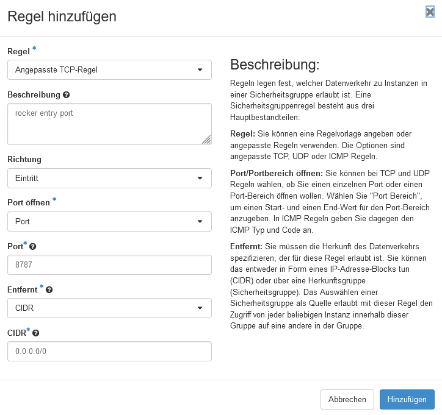
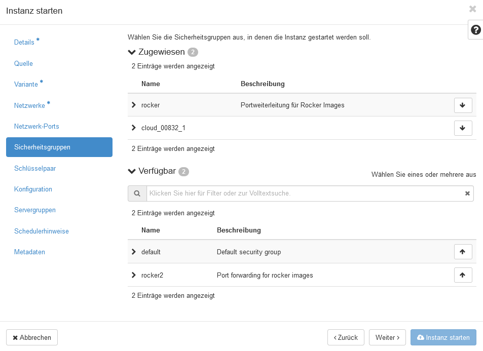
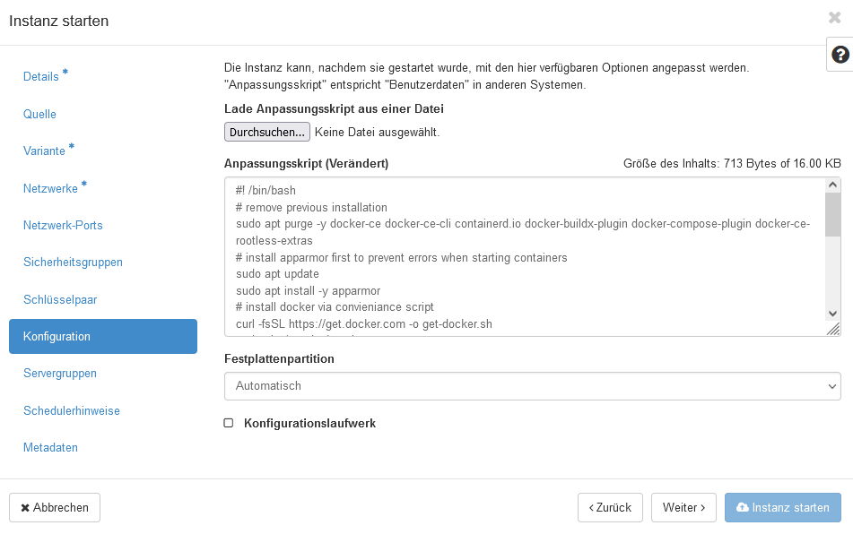

# Installation of a docker image on CODE-DE plattform

## Introduction

This README guides through the installation process of a docker image
containing a reproducible environment with the mscomposer package
on the CODE-DE platform. We are going to use the [rocker](https://rocker-project.org/) 
geospatial image as our base image, since it contains most of the required geospatial software.
Spinning up the image in the right way will allow you to access an R-Studio instance running
on CODE-DE premisis from your browser and accessing the functionality of the mscomposer
package and other useful geospatial software. 

## Prerequsites

In order to make the docker container available, we need to declare a new security group ("Sicherheitsgruppe")
to allow port-forwarding from our VM to the container. By default, the rocker images use the 8787 port, so
we are going to use the same here in your example. However, you can change the default port if required.

In the CODE-DE dashboard, go to Network -> Security Group and click "Create security group".
Here, you first have to add a name and optionally a description for the group you are going to add.
After you created the group, two outbound rules are already present. We now need to add an additional
rule for inbound connections, thus we have to clickon "Add rule". This will open a new
window where we can specify several options. 

For now, we will leave everything at the default values,
except opening the 8787 port for al inbound connections Note, that you could for example, accept only
inbound connections from certain IP addresses or ranges. However, we will not go into the details of
the customization here. 

Importantly, you should select "inbound" for the direction, "port" for opening port and specify "8787" (or any
other port you decided to use) as the port for accepting inbound connections.

## Creating an instance with Docker

After setting up the new security group, we are ready to create an instance with the right settings
to run the rocker images. We assume that you are using the Ubuntu 20.04 LTS base image here and will
only focus on those settings that are required to sucessfully run docker and reach the rocker image.
First, in the "Security Group" section make sure that the newly created rocker security group is 
assigned to the new instance, as well as any other security group you might require.

Then head over to the "Configuration" tab and either copy and paste the content of "install-docker.sh"
into the text field or select the file from your local drive. This will set up docker engine during
the creation of the instance. It will also automatically install the mscomposer package. 
You can make changes to the last line of the script to set a custom password for the default user 
called 'rstudio' an adjust the port mapping of the container to the host machine-
Once your are done with all other steps, you are ready to start the new instance.
After the instance has been initialized, you need to assign a floating IP to it.
Then, you can access the RStudio instance from your webbrowser giving the containers IP 
address as well as the port that was configured. The default user name is 'rstudio' and the
password defaults to 'opendata' if not customized by you.

